#  Design and Deploy a Secure AWS VPC Infrastructure by Tobey Ndlovu

##  Project Overview

A startup requires a secure AWS networking foundation capable of supporting a tiered application architecture. Public-facing resources must remain accessible to authorised users while backend resources remain isolated from direct internet access.

This project demonstrates the design and deployment of a secure AWS Virtual Private Cloud (VPC) that follows AWS networking best practices. The solution implements network segmentation, secure routing, layered security controls, and administrative access patterns to create a production-grade networking foundation.

---

#  Project Objectives

This project demonstrates the ability to:

- Design a secure AWS Virtual Private Cloud (VPC)
- Configure public and private subnets
- Deploy and configure an Internet Gateway
- Deploy and configure a NAT Gateway
- Configure Public and Private Route Tables
- Implement custom Network ACLs (NACLs)
- Configure Security Groups using the Principle of Least Privilege
- Secure administrative access using a Bastion Host
- Produce professional technical documentation

---

#  Architecture Diagram

The following diagram illustrates the overall architecture, including the custom VPC, public and private subnets, Internet Gateway, NAT Gateway, route tables, Security Groups, Network ACLs, Bastion Host, and routing paths.

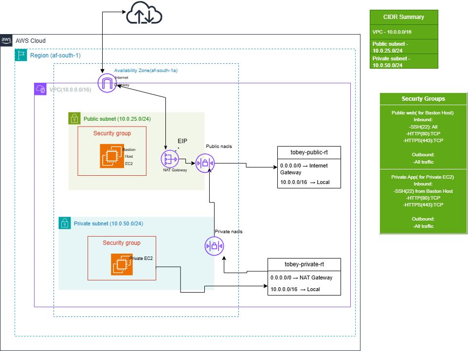

---

#  AWS Services Used

- Amazon VPC
- Amazon EC2
- Public Subnet
- Private Subnet
- Internet Gateway
- NAT Gateway
- Route Tables
- Security Groups
- Network ACLs
- Elastic IP
- Amazon Linux 2023
- Nginx
- SSH

---

# 📷 Infrastructure Proof

## 1. Custom VPC

A custom Virtual Private Cloud was created using the CIDR block **10.0.0.0/16**, providing an isolated networking environment for all AWS resources.

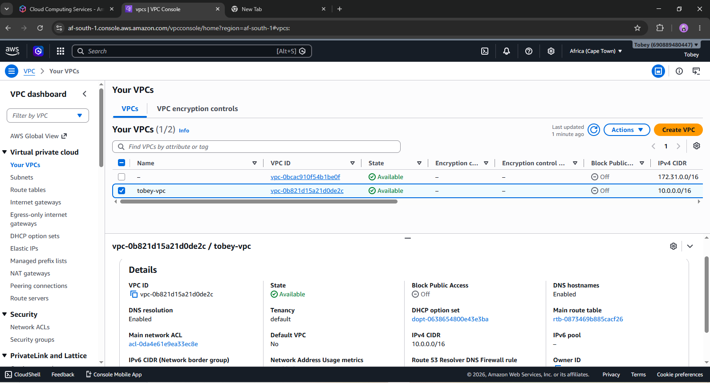

---

## 2. Internet Gateway

An Internet Gateway (IGW) was created and attached to the VPC to provide internet connectivity for resources deployed in the public subnet.

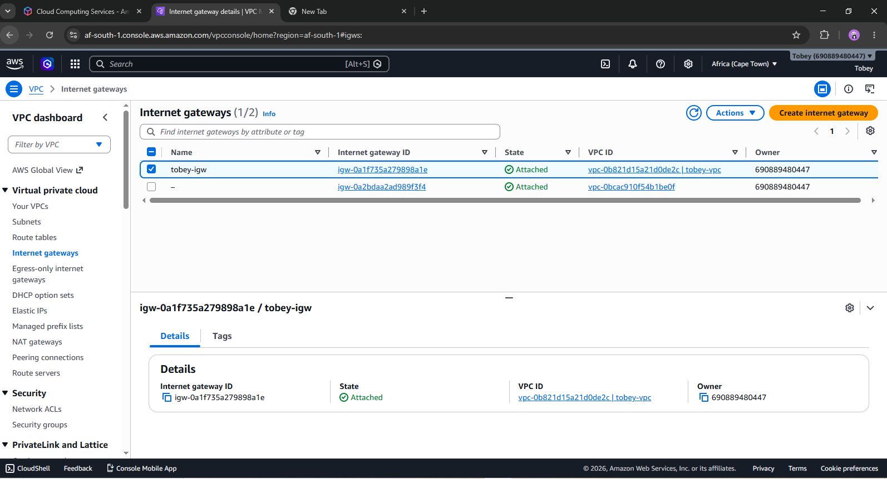

---

## 3. Public Subnet

A public subnet (**10.0.25.0/24**) was created within the same Availability Zone as the private subnet. It hosts internet-facing resources such as the Bastion Host and NAT Gateway.

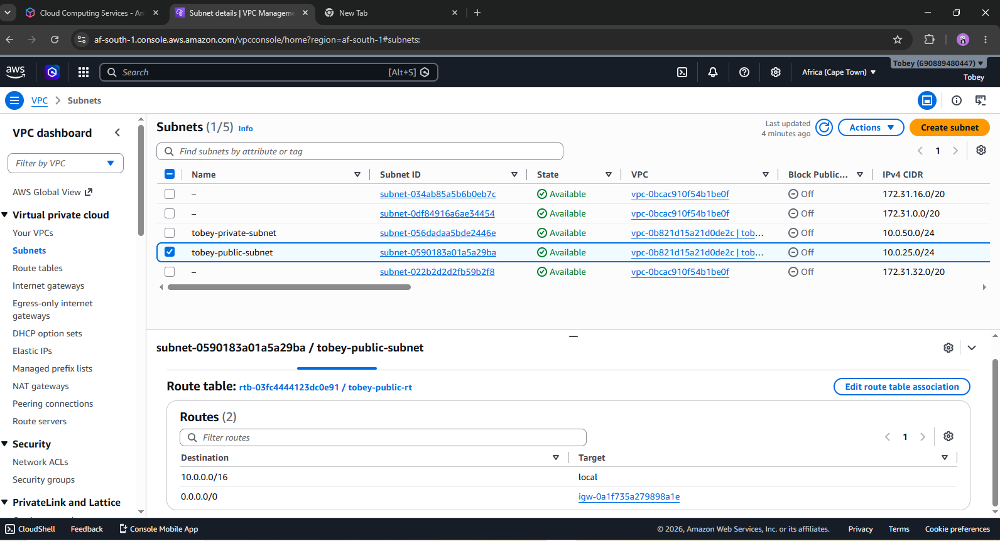

---

## 4. Public Route Table

A dedicated public route table was configured with a default route (**0.0.0.0/0**) pointing to the Internet Gateway, allowing outbound and inbound internet communication for public resources.

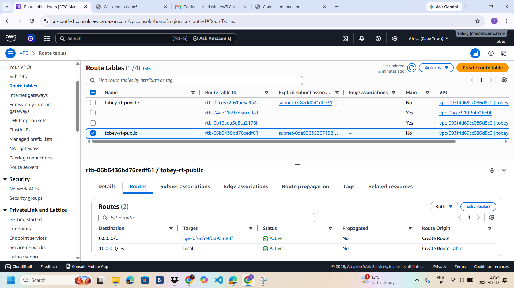

---

## 5. Public Network ACL

A custom Network ACL was configured to provide subnet-level traffic filtering for the public subnet while allowing HTTP, HTTPS, SSH, and required ephemeral ports.


---

## 6. Bastion Host Security Group

A Security Group was configured for the Bastion Host, allowing inbound SSH access (TCP Port 22) from trusted IP addresses while permitting outbound communication.

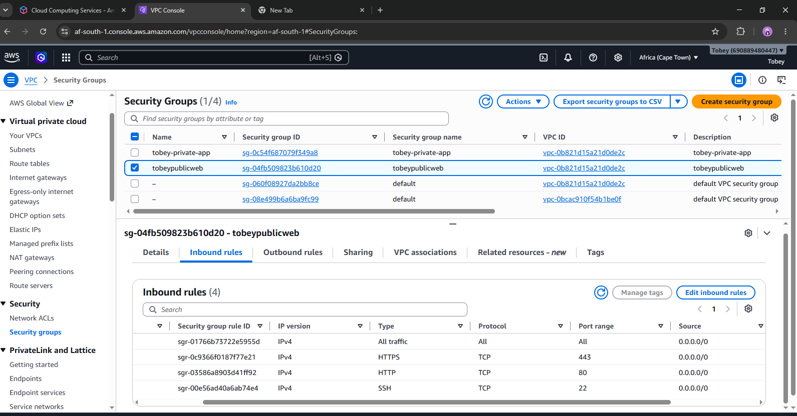

---

## 7. Bastion Host

A Bastion Host was deployed within the public subnet to provide secure administrative access to resources hosted in the private subnet.

.png)

---

## 8. Nginx Verification

Nginx was successfully installed and configured on the Bastion Host to verify internet connectivity and demonstrate Linux server administration.

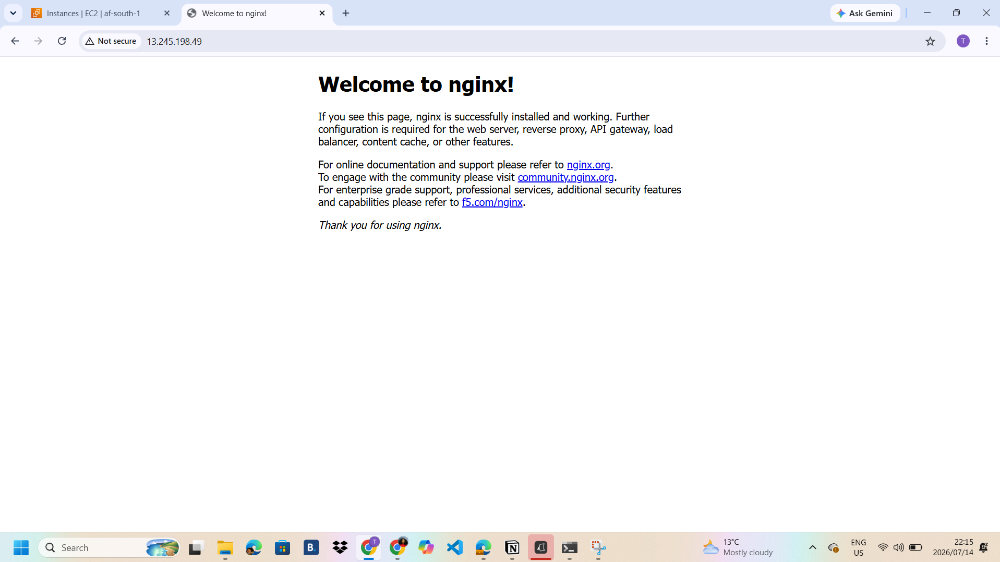

---

## 9. NAT Gateway

A NAT Gateway with an Elastic IP was deployed inside the public subnet to provide secure outbound internet connectivity for resources located within the private subnet.

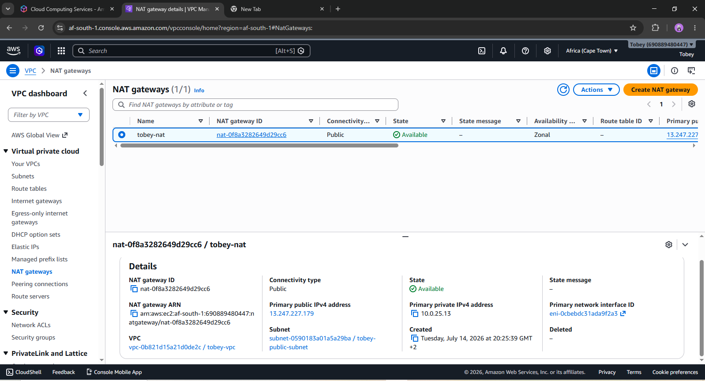

---

## 10. Private Subnet

A private subnet (**10.0.50.0/24**) was created to host internal resources that should never be directly accessible from the public internet.

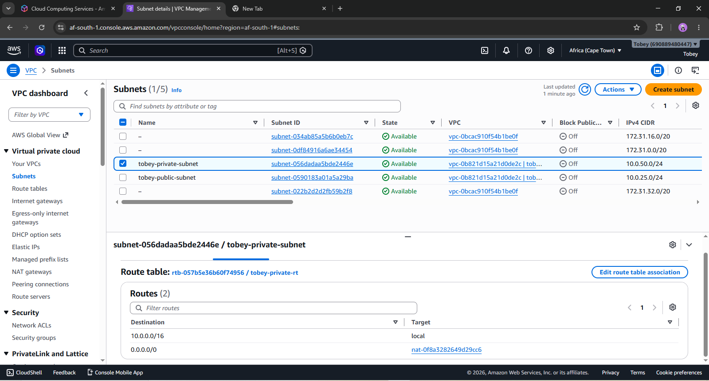

---

## 11. Private Route Table

A dedicated private route table was configured with a default route pointing to the NAT Gateway, allowing outbound internet connectivity while preventing direct inbound access.

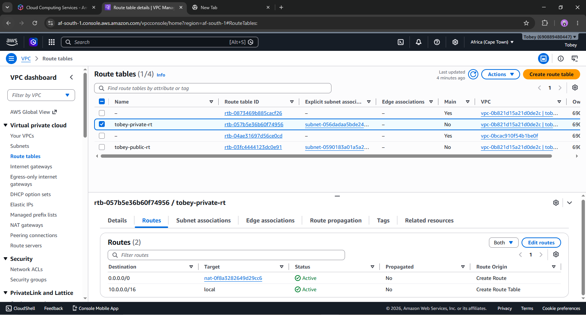

---

## 12. Private Network ACL

A custom Network ACL was configured to provide subnet-level security for resources hosted within the private subnet.

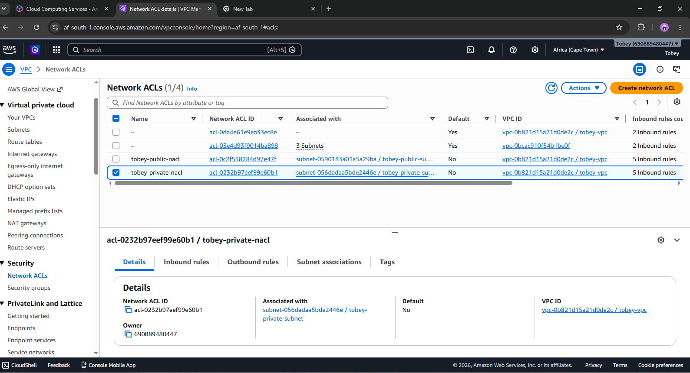

---

## 13. Private EC2 Security Group

A Security Group was configured to allow SSH access only from the Bastion Host Security Group, ensuring the private instance cannot be accessed directly from the internet.

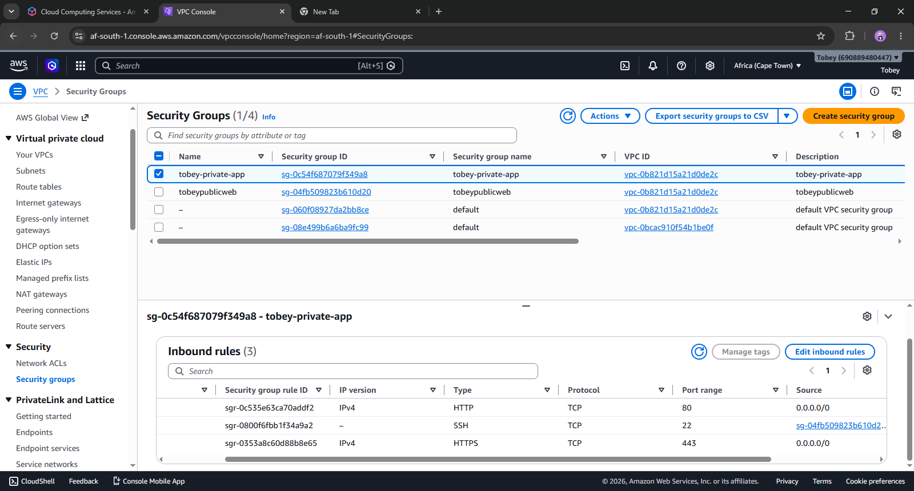


---

# 🔍 Connectivity Verification Theory

## Internet Access for the Private EC2 Instance

The private EC2 instance does not have a public IP address and therefore cannot communicate directly with the Internet Gateway.

Instead, outbound traffic follows this path:

```
Private EC2
      │
      ▼
Private Route Table
      │
      ▼
NAT Gateway
      │
      ▼
Internet Gateway
      │
      ▼
Internet
```

This allows the private EC2 instance to:

- Download operating system updates
- Install software packages
- Access external repositories
- Maintain security patches

without exposing the instance to inbound internet traffic.

---

## Secure Administrative Access

Administrative access to the private EC2 instance is achieved through the Bastion Host.

```
Administrator
      │
      ▼
Internet
      │
      ▼
Internet Gateway
      │
      ▼
Bastion Host
      │
 SSH Agent Forwarding
      │
      ▼
Private EC2
```

This architecture ensures that the private instance remains inaccessible from the public internet while still allowing secure administration.

---

## Why External Users Cannot Access the Private Instance

External users cannot directly connect to the private EC2 instance because:

- The instance has no public IP address.
- It resides within a private subnet.
- The private route table has no direct route to the Internet Gateway.
- The Security Group only permits SSH access from the Bastion Host Security Group.
- Network ACLs provide an additional layer of subnet-level traffic filtering.

This layered security approach follows the **Principle of Least Privilege** and AWS security best practices.

---

# Security Controls Implemented

- Custom VPC
- Public and Private Subnets
- Internet Gateway
- NAT Gateway
- Public & Private Route Tables
- Security Groups
- Custom Network ACLs
- Bastion Host Architecture
- Least Privilege Access
- SSH Agent Forwarding
- Private Resource Isolation

---

#  AWS Well-Architected Framework Alignment

This project aligns with several AWS Well-Architected Framework pillars:

- **Security** – Layered protection using Security Groups and Network ACLs.
- **Reliability** – Structured networking with dedicated routing components.
- **Performance Efficiency** – Separate networking components for public and private workloads.
- **Cost Optimization** – Designed using AWS Free Tier eligible resources where possible.
- **Operational Excellence** – Comprehensive documentation and architecture diagrams support repeatable deployments.

---

#  Skills Demonstrated

- AWS Networking
- Amazon VPC
- Cloud Security
- EC2 Deployment
- Public & Private Subnets
- Route Tables
- Internet Gateway
- NAT Gateway
- Security Groups
- Network ACLs
- Linux Administration
- SSH
- Nginx
- Infrastructure Design
- Cloud Troubleshooting

---

#  Learning Outcomes

Through this project, I gained practical experience designing and deploying secure AWS networking infrastructure while applying industry best practices for cloud security and network isolation.

Key concepts reinforced include:

- VPC architecture design
- Network segmentation
- Secure routing
- Layered security
- AWS networking services
- Infrastructure documentation
- Cloud engineering fundamentals

This project serves as a strong foundation for future work involving load balancing, Auto Scaling, Infrastructure as Code (IaC), and production-grade cloud architectures.
